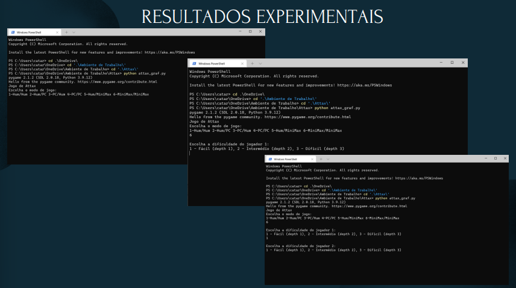
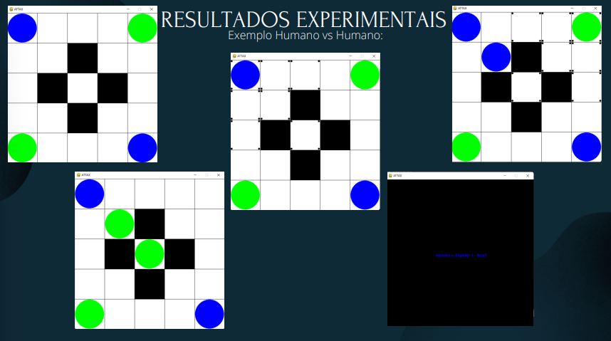

# Attax-Game
First assignment of the course Elements of Artificial Intelligence and Data Science (1st year, 2nd semester - 21/22)

## A little context
### Goal of the work
The aim of this work was to develop, in the Python language, the code, algorithm, and interface for the Attax game board. It was also intended to implement an artificial intelligence algorithm (MiniMax with alpha beta pruning) capable of playing against an adversary. There are six possible game modes, with the option to choose the desired difficulty level when using the aforementioned algorithm.

### Initial State
A square board with 4 pieces (2 from each player in opposite corners).
The boards are represented in text files (.txt) as square matrices (n*n) where there is the following correspondence:
* 0: blank spaces
* 1: blue pieces
* 2: green pieces
* 8: black pieces (where you cannot put a piece)

### Final State
The final state is reached when there are no more possible plays, whether it is because there are no more blank spaces or due to the fact that none of the players can make a legal move.
At the end of the game, there will be a pop-up indicating the winner.

### Heuristics
Number of pieces (as many as possible) that become the respective player's
* function: count_pieces"

### Function Evaluation
At each move/play simulation, the function evaluates by counting the number of pieces for each player in order to determine who is closer to victory (by subtracting one player's number of pieces from the other).

### Structure of the data, file and algorithm
There is a set of functions whose purpose is to read text files that will give rise to the board configuration (show_board, initialize_board, read_game); read the number of pieces in play (evaluate); determine which player will make the next move (other_player), among other functions.

### Graphic interface
For the graphical interface implementation (board, player pieces...), pygame was used with the intention of better communication with the player. All code was developed in Microsoft Visual Studio 2022.

## How to run the code?
In order to enjoy the game, you will need to follow these steps:
* Open the terminal (Windows PowerShell, among others).
* Change to the directory where the game is stored using the cd command (be mindful of the text files containing the boards, as otherwise it will lead to errors). (e.g., $ cd Downloads)
* Once you are in the correct directory, execute the following command line: python attax.py;
* A game menu will appear where you can choose the game mode you want to play, with the following options: 1- Human vs Human, 2- Human vs Computer, 3- Computer vs Human, 4- Computer vs Computer;
* If you have chosen one of the options 2, 3, or 4, you will also have the option to choose the difficulty level for the computer;
* After making your selection, a series of board options will appear, and you can choose the one you prefer by clicking on it;
* Once all these steps are completed, you can finally start playing!
* The first player will have blue-colored balls, and the second player will have green-colored balls;
* When selecting your ball, a selection of squares will appear where you can move/expand your ball;
* The ultimate goal of the game is to make your opponent run out of balls on the board!

